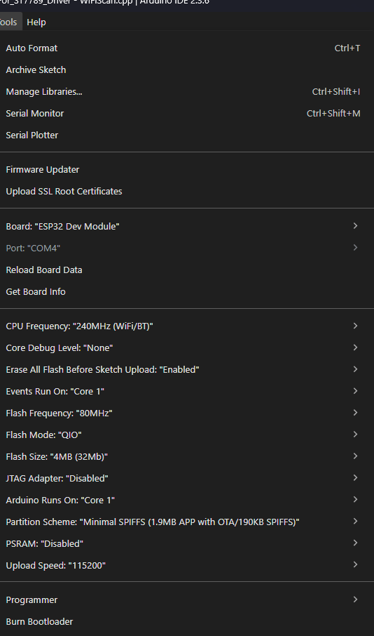
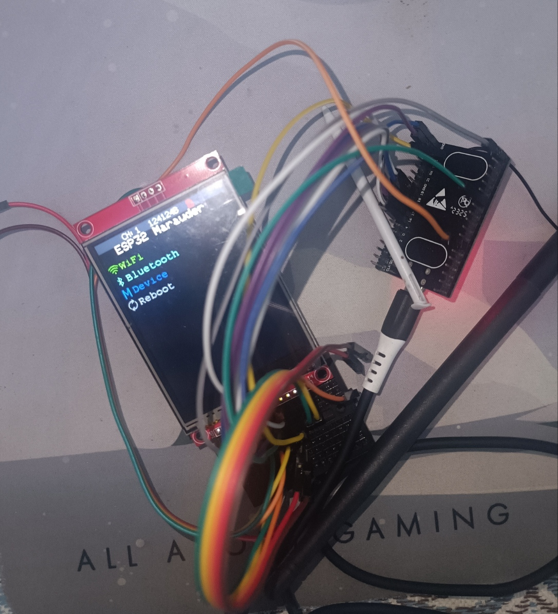

# ESP32 Marauder Build - ILI9341 & SD Card

This repository contains the configuration and wiring details for building an ESP32 Marauder using a standard ESP32 DevKit and an ILI9341 2.8" TFT display (with Touch and SD Card slot).

## 🔌 Wiring Pinout
Based on the hardware configuration for this build, follow the wiring tables below.

### 1. Display & Touch Interface
The display and touch controller share the SPI bus (MOSI, MISO, SCK).

| ILI9341 Pin | Label | → | ESP32 Pin |
| :--- | :--- | :---: | :--- |
| 1 | VCC | → | 3.3V |
| 2 | GND | → | GND |
| 3 | CS | → | D17 (TXD 2) |
| 4 | RESET | → | D5 |
| 5 | DC | → | D16 (RXD 2) |
| 6 | SDI (MOSI) | → | D23 |
| 7 | SCK | → | D18 |
| 8 | LED | → | D32 |
| 9 | SDO (MISO) | → | D19 |
| 10 | T_CLK | → | D18 |
| 11 | T_CS | → | D21 |
| 12 | T_DIN | → | D23 |
| 13 | T_DO | → | D19 |
| 14 | T_IRQ | → | X (Not Connected) |

### 2. SD Card Interface
The SD card module also shares the SPI bus but requires a dedicated Chip Select (CS) pin.

| SD Card Pin | Label | → | ESP32 Pin |
| :--- | :--- | :---: | :--- |
| 1 | CS | → | D12 |
| 2 | MOSI | → | D23 |
| 3 | MISO | → | D19 |
| 4 | SCK | → | D18 |

---

# ESP32 Marauder - Custom ILI9341 Build

This repository contains a pre-configured, self-contained build for the ESP32 Marauder. It is designed to work with an **ILI9341 2.8" TFT** and uses a local library structure to ensure all dependencies are compatible.

## Project Structure
This build is organized as a standalone sketchbook.

```text
├── ESP32Marauder-For-ILI9341-TFT  <-- Main firmware source
├── libraries                      <-- Local dependencies (TFT_eSPI, LVGL, etc.)
└── main                           <-- Core logic components
```

##  Installation Guide

Follow these steps to set up and run ESP32 Marauder on your device.

---

### 1. Install Arduino IDE
Download and install Arduino IDE:
https://www.arduino.cc/en/software

---

### 2️ Install ESP32 Board Support
1. Open Arduino IDE  
2. Go to **File → Preferences**  
3. Add this URL in *Additional Board Manager URLs*:
https://espressif.github.io/arduino-esp32/package_esp32_index.json,https://raw.githubusercontent.com/espressif/arduino-esp32/gh-pages/package_esp32_index.json

4. Go to **Tools → Board → Board Manager**  
5. Search **ESP32** and install **ESP32 by Espressif Systems**

---

### 3. Install Required Libraries

move the libraries folder to : 
```text
Documents/Arduino/libraries/
```
---

### 4. Select Board & Port
- Board: `ESP32 Dev Module`  
- Set correct COM port in **Tools → Port**

---

### 5. Change the config as provided in the image
 


## Components List
Below are the hardware components used in this specific build. Refer to the `/images` directory for visual identification.

| Component | Description | Reference Image |
| :--- | :--- | :--- |
| **MCU** | ESP32-WROOM-32U (External Antenna Support) | `ESP32-WROOM-32U.jpg` |
| **Display** | ILI9341 2.8" TFT LCD (Touch + SD Slot) | `ILI9341_screen.jpg, ILI9341_screen_back.jpg ` |
| **Antenna** | 2.4GHz WiFi Antenna + IPEX to RP-SMA Pigtail | `wifi_antenna.jpg, IPEX_To_RP-SMA.jpg` |
| **Storage** | Micro SD Card (For PCAP saving) | `sd_card.jpg` |
| **Prototyping** | Breadboard &  Jumper Wires | `bread_board.jpg, cables.jpg` |
| **Interface** | USB Data Cable | `USB-B_caple.jpg` |


## Full Build
